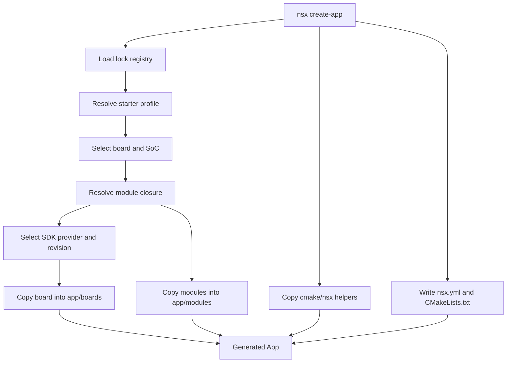

# App Generation Flow

This page shows how `nsx create-app` turns a board choice into a standalone
generated app.

## Result

The result is a single-target app that contains the vendored board and module
content needed for configure, build, flash, and SWO view.
