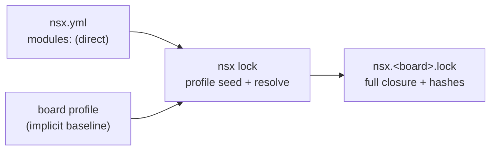

# Dependency Model

NSX apps declare dependencies the same way modern package managers do: a
single list of **direct** dependencies, where the full resolved closure is a
generated artifact, not something you hand-maintain.

If you have used Cargo, uv, or npm, you already know this model.

## One list: `modules:`

An app's `nsx.yml` carries exactly one dependency list — `modules:`. Each
entry is a module the app depends on **directly**. Everything those modules
pull in transitively is resolved for you and written to the lock file.

```yaml
schema_version: 2
project:
  name: my_app
toolchain: arm-none-eabi-gcc
targets:
  default: apollo510_evb
  supported:
    - apollo510_evb
    - apollo510b_evb
modules:
  - nsx-timer          # registry dependency, all targets
  - nsx-pmu-armv8m
```

There is no separate "requires" list, no "lean vs explicit" mode, and no
inlined closure. You declare intent; `nsx lock` derives the rest.

## The board profile is the implicit baseline

Every supported board ships a **profile** — its baseline set of modules (SoC
HAL, BSP, CMSIS/startup, runtime core). That baseline is implicit: you never
re-declare it in `modules:`. Your `modules:` list is *additive* on top of the
board profile.

Think of the profile as the standard library: always present, never listed.

If you need an app whose `modules:` list is the **authoritative** closure
(bare-metal, no implicit baseline), opt out per app:

```yaml
baseline: none        # modules: is the complete, authoritative dependency set
```

## Entry forms

Each `modules:` entry is either a bare name (shorthand) or a mapping.

```yaml
modules:
  - nsx-timer                          # shorthand: { name: nsx-timer }
  - name: nsx-pdm
    boards: [apollo510_evb]            # board-scoped (subset of targets.supported)
  - name: my-driver
    source: { path: ../my-driver }     # linked from an external directory
  - name: aot-model
    source: { vendored: true }         # committed in-tree, never re-fetched
```

The bare-string form is sugar for a mapping with only `name`, exactly like
Cargo's `serde = "1"` versus `serde = { version = "1" }`.

### `source:` — where the contents come from

| Form                          | Meaning                                              |
| ----------------------------- | ---------------------------------------------------- |
| _omitted_                     | Registry default (git project or packaged copy)      |
| `source: { path: <p> }`       | Linked external directory, mirrored on each `nsx sync` |
| `source: { vendored: true }`  | Committed inside the app; `nsx sync` never touches it |

See [Lock & Sync](../user-guide/lock-and-sync.md) for how each source maps to a
lock kind and sync behaviour.

### `boards:` — per-entry target scope

A dependency that only applies to some of the app's `targets.supported`
carries a `boards:` filter. Absent means "all targets"; a list scopes the
dependency to those boards (and must be a subset of `targets.supported`). This
is the analog of Cargo's `[target.'cfg(...)'.dependencies]`.

The `boards:` filter is a small structured field so a future family-level
filter (for example `socs:`) can be added without a schema change.

## The closure lives only in the lock

`nsx.yml` records **direct** dependencies. The fully resolved closure — every
transitive module, its exact commit, and a content hash — lives only in
`nsx.<board>.lock`. Each supported board gets its own lock, so every target is
independently reproducible.



`nsx module add` / `remove` edit the single `modules:` list and refresh the
affected lock(s); the closure is never authored by hand.

## How it maps to package managers you know

| Concept                         | Cargo                                   | uv / pip               | npm                     | NSX                          |
| ------------------------------- | --------------------------------------- | ---------------------- | ----------------------- | ---------------------------- |
| Direct dependency list          | `[dependencies]`                        | `[project].dependencies` | `dependencies`         | `modules:`                   |
| Bare-name shorthand             | `serde = "1"`                           | `"requests"`           | `"react": "^18"`        | `- nsx-timer`                |
| Local / path source             | `{ path = "../x" }`                     | `{ path = "../x" }`    | `"file:../x"`           | `source: { path: ../x }`     |
| Vendored / committed copy       | vendored dir                            | vendored dir           | committed `node_modules`| `source: { vendored: true }` |
| Target-conditional dependency   | `[target.'cfg(...)'.dependencies]`      | environment markers    | (none built-in)         | `boards: [...]`              |
| Implicit baseline ("std")       | `std`                                   | stdlib                 | runtime                 | board profile                |
| Generated closure / lock        | `Cargo.lock`                            | `uv.lock`              | `package-lock.json`     | `nsx.<board>.lock`           |

## Roadmap

Git-source dependencies (`source: { git: <url>, rev: <ref> }`, with matching
`nsx module add --git/--rev`) are planned. Until they land, registry, path, and
vendored sources cover the supported cases; a git-sourced entry raises a clear
"not yet supported" error during resolution.

## See also

- [Modules](../user-guide/modules.md) — adding, removing, and updating modules
- [Module Model](module-model.md) — module classes, compatibility, source modes
- [Lock & Sync](../user-guide/lock-and-sync.md) — lock kinds and sync behaviour
- [Multi-Target & Portability](multi-target-portability.md) — per-target builds
