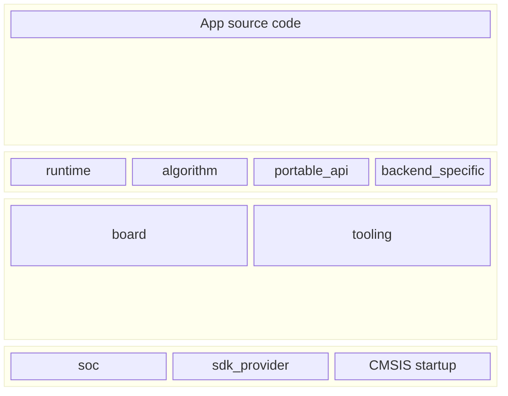

# Module Model

## Module Classes

NSX modules are classified as:

1. `soc`: SoC-level HAL/CMSIS/startup integration.
2. `sdk_provider`: SDK-family binding (for example AmbiqSuite `r3`/`r4`/`r5`).
3. `board`: board-specific configuration and policy.
4. `runtime`: shared runtime support for apps/tools.
5. `portable_api`: thin convenience wrappers.
6. `algorithm`: algorithm/functionality modules.
7. `tooling`: helpers for build/deploy/view workflows.
8. `backend_specific`: modules tied to a specific backend/board class.

## Backend Policy

1. NSX module eligibility requires `support.ambiqsuite=true`.
2. NSX modules may also support Zephyr (`support.zephyr=true`).
3. Zephyr-only modules are out of NSX registry scope.
4. For dual-support modules, Zephyr integration lives in a `/zephyr` subfolder
   in the same repo.

## Baseline vs Optional Stacks

Baseline NSX profiles should stay focused on AI inference and profiling bring-up:

1. SoC HAL + BSP + CMSIS/startup
2. runtime core
3. profiling/perf instrumentation helpers

Non-essential by default (optional modules only):

1. BLE stacks (for example Cordio)
2. network/transport stacks
3. RTOS stacks (for example FreeRTOS)

Rationale:

- Zephyr support may lag AmbiqSuite by multiple months.
- For new products and performance-sensitive profiling, AmbiqSuite-backed NSX
  flows are the primary path.

## Dependency Rules

1. Module dependencies are declared in `nsx-module.yaml`.
2. CMake target dependencies remain authoritative during build.
3. NSX CLI resolves dependency closure before mutation.
4. Cycles are rejected.
5. Board modules must depend on exactly one SoC module.

## Semantic Metadata For Discovery

`nsx-module.yaml` may also carry optional semantic fields used by agents and
discovery tooling.

Current optional fields:

1. `summary`: one-sentence plain-language description of the module
2. `capabilities`: flat capability tags such as `profiling`, `pmu`, `logging`, or `i2c`
3. `use_cases`: concrete tasks this module is a good fit for
4. `anti_use_cases`: cases where this module is the wrong choice
5. `agent_keywords`: extra search terms that help intent mapping
6. `example_refs`: references to example apps or docs
7. `composition_hints`: pairing or composition notes for planning tools

These fields do not change build behavior. They exist so command-discovery and
module-discovery surfaces can support LLM and agent workflows without forcing
freeform inference from repo names or prose docs.

## Compatibility Rules

Each module declares compatibility for:

1. boards
2. socs
3. toolchains

Compatibility is enforced at CLI operation time (hard-fail on mismatch) before
build invocation.

Recommended interpretation:

1. use broad compatibility (`*`) for generic modules
2. constrain SoC-family infrastructure modules by SoC
3. constrain board helper/example modules by board only when wiring or EVB
   assumptions require it

## Source Modes for Modules

NSX supports module sources in these forms:

1. curated source repos or local repo snapshots
2. local filesystem path source (registered per app)
3. vendored app-local copies after `nsx create-app` or `nsx module add`
