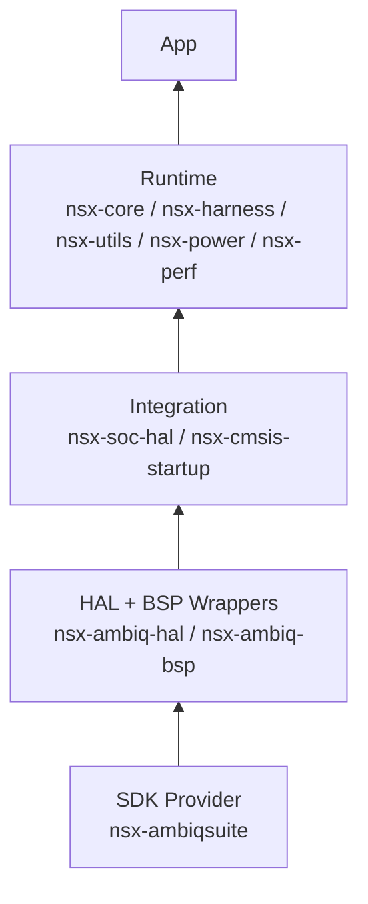

# Overview

NSX provides a modular bare-metal application workflow for Ambiq targets.

## Primary Goals

1. Fast bootstrap for board-specific apps.
2. Reproducible module and board vendoring into generated apps.
3. Clear build behavior driven by CMake.
4. Small, inspectable projects for bring-up, profiling, and feature validation.

## Core Principles

1. AmbiqSuite-first baseline for bare-metal targets.
2. Single-target apps by default.
3. CMake as build truth.
4. Explicit metadata for dependency and compatibility decisions.
5. Wrapper modules for curated SDK consumption.

## Implemented Architecture

NSX currently provides:

1. a Python CLI (`nsx`)
2. packaged app templates
3. packaged CMake helpers
4. built-in board definitions
5. curated lock metadata for known module sets

Generated apps receive:

1. app-local `cmake/nsx/`
2. vendored `modules/`
3. vendored `boards/`
4. target metadata in `nsx.yml`

## Current Layering

1. the raw SDK provider module `nsx-ambiqsuite`
2. the HAL and BSP wrapper modules `nsx-ambiq-hal` and `nsx-ambiq-bsp`
3. shared NSX integration modules such as `nsx-soc-hal` and
   `nsx-cmsis-startup`
4. higher-level runtime modules such as `nsx-core`, `nsx-harness`,
   `nsx-utils`, `nsx-power`, and `nsx-perf`

## Target Environment

NSX is intended for:

1. board bring-up
2. smoke tests
3. profiling and instrumentation workflows
4. small targeted examples such as USB or interface validation
