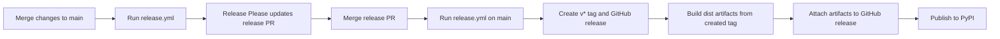

# Releases

NSX uses Release Please to manage version bumps, changelog entries, and tagged
releases for the Python package.

## Release Flow

1. Changes land on `main`.
2. The `release.yml` workflow runs Release Please on `main`.
3. Release Please updates or opens a release PR.
4. When the release PR is merged, the next `release.yml` run on `main` creates:
   - a new version commit
   - an updated `CHANGELOG.md`
  - a release tag such as `neuralspotx-v0.6.3`
    - the GitHub release entry
5. That same `release.yml` run then:
    - checks out the created tag
   - validates that the tag matches `pyproject.toml`
   - builds the Python distributions
   - attaches the artifacts to the GitHub release
    - publishes the distributions to PyPI

## Version Source of Truth

The package version in `pyproject.toml` is the version source of truth for the
Python package at release time.

The release workflow validates that:

- the release tag ends with `v<version>`
- the tag version exactly matches `pyproject.toml`

Example:

- `pyproject.toml`: `0.2.0`
- release tag: `neuralspotx-v0.2.0`

If those do not match, the release build fails.

## Manual Rebuilds

`release.yml` also supports `workflow_dispatch` with an optional `tag` input.

This is intended only for rebuilding an existing tagged release, for example
when:

- artifact upload failed
- the workflow logic changed and you need to regenerate release artifacts

This manual path does not create a new version or release PR. It rebuilds
artifacts for an existing release tag such as `neuralspotx-v0.6.3`.

## PyPI Publishing

PyPI publishing runs in the same `release.yml` workflow as Release Please, the
artifact build, and the GitHub release asset upload.

This is intentional. PyPI trusted publishing must stay in the same workflow
file as the release job, because PyPI does not support delegating the publish
step to a reusable workflow.

The publish job uses GitHub OIDC trusted publishing against the repository's
configured PyPI project. It runs when Release Please creates a root release in
that workflow, or when a manual rebuild targets an existing release tag.

## Contributor Guidance

- Do not create ad hoc release tags outside the Release Please flow.
- Do not hand-edit version numbers unless you are intentionally repairing the
  release metadata.
- If a tagged release needs to be retried, use the manual rebuild path for the
  existing tag.
- Keep release notes and changelog generation owned by Release Please.
