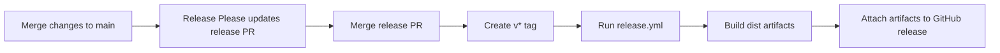

# Releases

NSX uses Release Please to manage version bumps, changelog entries, and tagged
releases for the Python package.

## Release Flow

1. Changes land on `main`.
2. Release Please updates or opens a release PR.
3. When the release PR is merged, Release Please creates:
   - a new version commit
   - an updated `CHANGELOG.md`
   - a `v*` git tag
4. The tag triggers the release workflow.
5. The release workflow:
   - checks out the tagged ref
   - validates that the tag matches `pyproject.toml`
   - builds the Python distributions
   - attaches the artifacts to the GitHub release

## Version Source of Truth

The package version in `pyproject.toml` is the version source of truth for the
Python package at release time.

The release workflow validates that:

- the release tag starts with `v`
- the tag exactly matches `pyproject.toml`

Example:

- `pyproject.toml`: `0.2.0`
- release tag: `v0.2.0`

If those do not match, the release build fails.

## Manual Rebuilds

`release.yml` also supports `workflow_dispatch` with an optional `tag` input.

This is intended only for rebuilding an existing tagged release, for example
when:

- artifact upload failed
- the workflow logic changed and you need to regenerate release artifacts

This manual path does not create a new version. It rebuilds artifacts for an
existing `v*` tag.

## PyPI Publishing

The workflow includes a disabled PyPI publish placeholder in the same workflow
file.

This is intentional. PyPI trusted publishing must stay in the same workflow
file as the release job, because PyPI does not support delegating the publish
step to a reusable workflow.

## Contributor Guidance

- Do not create ad hoc release tags outside the Release Please flow.
- Do not hand-edit version numbers unless you are intentionally repairing the
  release metadata.
- If a tagged release needs to be retried, use the manual rebuild path for the
  existing tag.
- Keep release notes and changelog generation owned by Release Please.
