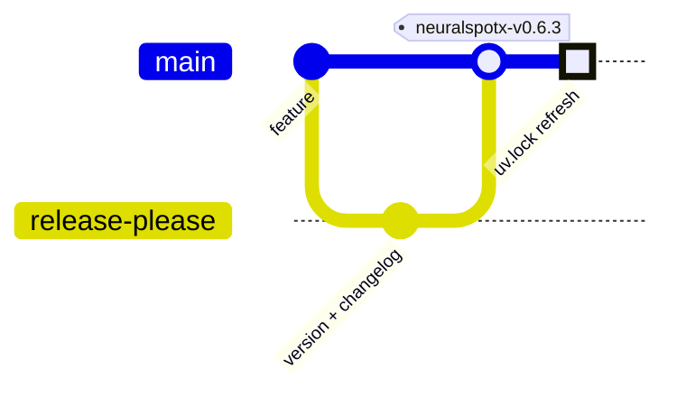

# Releases

NSX uses Release Please to manage version bumps, changelog entries, and tagged
releases for the Python package.

## Release Flow

Releases are automated through the `release.yml` workflow. As a contributor you
take **two actions** — everything else runs in CI:

1. **Merge your change to `main`.** Release Please opens or updates a *release
   PR* that accumulates the version bump and changelog.
2. **Merge the release PR.** That triggers the release: tag, GitHub release,
   built distributions, and a PyPI publish.

The tag triggers the rest of `release.yml` automatically: it builds and checks
the Python distributions, smoke-tests the installed wheel, attaches the
artifacts to the GitHub release, and publishes to PyPI. A follow-up PR is opened
only if `uv.lock` needs a version refresh (see
[uv.lock Refresh](#uvlock-refresh)).

## Version Source of Truth

The package version in `pyproject.toml` is the version source of truth for the
Python package at release time.

The release workflow validates that:

- the release tag is exactly `v<version>` or `neuralspotx-v<version>`
- the tag version exactly matches `pyproject.toml`

Example:

- `pyproject.toml`: `0.2.0`
- release tag: `neuralspotx-v0.2.0`

If those do not match, the release build fails.

## Manual Rebuilds

`release.yml` also supports `workflow_dispatch` with an optional `tag` input.

This is intended only for rebuilding an existing tagged release, for example
when:

- artifact upload failed
- the workflow logic changed and you need to regenerate release artifacts

This manual path does not create a new version or release PR. It rebuilds
artifacts for an existing release tag such as `neuralspotx-v0.6.3` or the
legacy form `v0.6.3`.

## PyPI Publishing

PyPI publishing runs in the same `release.yml` workflow as Release Please, the
artifact build, and the GitHub release asset upload.

This is intentional. PyPI trusted publishing must stay in the same workflow
file as the release job, because PyPI does not support delegating the publish
step to a reusable workflow.

The publish job uses GitHub OIDC trusted publishing against the repository's
configured PyPI project. It runs when Release Please creates a root release in
that workflow, or when a manual rebuild targets an existing release tag.

Before either GitHub or PyPI receives an artifact, the release job:

1. runs `twine check` against both the wheel and source distribution
2. installs the wheel into an isolated environment
3. creates an app without network bootstrap
4. creates and validates a module scaffold

These checks exercise packaged templates from the installed distribution. A
command working from a source checkout is not sufficient evidence that its
templates or other data files were included in the wheel.

## uv.lock Refresh

After a successful new release from `main`, the same workflow updates the
editable `neuralspotx` version line in `uv.lock` to match `pyproject.toml` and
opens or updates a follow-up PR with that change, then dispatches CI on that
branch. Only the editable package version line is touched; transitive
dependency pins are left untouched, and the job is a no-op (no PR) when the
lockfile is already in sync.

## Contributor Guidance

- Do not create ad hoc release tags outside the Release Please flow.
- Do not hand-edit version numbers unless you are intentionally repairing the
  release metadata.
- If a tagged release needs to be retried, use the manual rebuild path for the
  existing tag.
- Keep release notes and changelog generation owned by Release Please.
- Treat distribution smoke-test failures as packaging regressions; do not
  bypass the check or publish the affected artifact manually.
