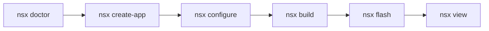

# First App

This page walks through the standard NSX app creation flow.

Use plain `nsx` commands throughout this guide.

If you installed with `pipx`, `nsx` is already on your `PATH`.
If you are working from a source checkout, activate the `uv` environment first:

```bash
cd <nsx-repo>
source .venv/bin/activate
```

## Goal

Create a minimal app, configure it, and build it successfully.



## Step 1: Check the Environment

```bash
nsx doctor
```

## Step 2: Create an App

```bash
nsx create-app hello_ap510 --board apollo510_evb
```

This creates a generated app at:

```text
hello_ap510
```

## Step 3: Configure the App

```bash
nsx configure --app-dir hello_ap510
```

## Step 4: Build the App

```bash
nsx build --app-dir hello_ap510
```

## What to Expect

The generated app contains:

- `CMakeLists.txt`
- `nsx.yml`
- `src/`
- `cmake/nsx/`
- `modules/`
- `boards/`

At this point you have a standalone app with vendored board and module content.

## Next Steps

- See **App Layout** for a breakdown of the generated structure
- See **Examples** for full working apps with flash and SWO output
- See **Modules** if you want to add or remove app dependencies
