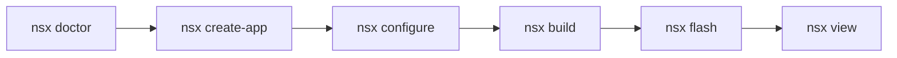

# First App

Walk through the full NSX lifecycle — scaffold a project, resolve
modules, compile firmware, flash it to an evaluation board, and watch
live SWO output. The whole process takes about two minutes.

!!! info "Prerequisites"
    Make sure `nsx doctor` passes before continuing.
    See [Install and Setup](install.md) if anything is missing.

## The Five-Command Workflow

Every NSX project follows the same pattern:



## Step 1 — Check Your Environment

```bash
nsx doctor
```

`doctor` scans for Python, CMake, Ninja, the Arm toolchain, and J-Link.
Fix any flagged issues before moving on.

## Step 2 — Scaffold a New App

```bash
nsx create-app hello_ap510 --board apollo510_evb
```

NSX creates a new directory called `hello_ap510/` containing:

| File / Directory | Purpose |
|---|---|
| `nsx.yml` | App manifest — board target, modules, and options |
| `CMakeLists.txt` | Top-level CMake entry point |
| `src/main.c` | Minimal application source |
| `cmake/nsx/` | Generated CMake helpers |
| `boards/` | Board pin and clock configuration |

Everything is ordinary CMake — no proprietary build wrappers.

## Step 3 — Resolve Modules and Generate the Build

```bash
nsx configure --app-dir hello_ap510
```

`configure` reads `nsx.yml`, fetches any required modules from the
registry (SDK provider, BSP, HAL, peripheral drivers), vendors them into
`modules/`, and generates the CMake build tree under `build/`.

!!! note
    First runs download modules from GitHub. Subsequent runs are fast
    because modules are cached locally.

## Step 4 — Build the Firmware

```bash
nsx build --app-dir hello_ap510
```

CMake + Ninja compile and link the firmware. The output binary lands in
`build/` — typically a `.bin` and `.axf` file ready for flashing.

## Step 5 — Flash the EVB (Optional)

```bash
nsx flash --app-dir hello_ap510
```

Requires a SEGGER J-Link connected to your Apollo510 EVB. The command
programs the binary over SWD and resets the target.

## Step 6 — Stream SWO Output (Optional)

```bash
nsx view --app-dir hello_ap510
```

Opens a live SWO viewer. You should see the hello-world print loop
streaming from the board.

## What's in the Generated App

After `nsx configure`, the full directory looks like:

```text
hello_ap510/
├── nsx.yml
├── CMakeLists.txt
├── src/
│   └── main.c
├── cmake/nsx/
├── boards/
├── modules/          ← vendored registry modules
└── build/            ← CMake build tree
```

Both `modules/` and `build/` are gitignored by default and regenerated
automatically — your source tree stays clean.

## Next Steps

- **[Examples](examples.md)** — eight maintained example apps covering
  CoreMark, PMU profiling, power measurement, audio, and USB
- **[App Layout](../user-guide/app-layout.md)** — deep dive into the
  generated directory structure
- **[Modules](../user-guide/modules.md)** — add or remove dependencies
  from your app manifest
