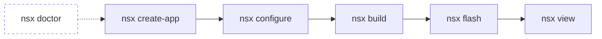

# First App

Walk through the full NSX lifecycle — scaffold a project, resolve
modules, compile firmware, flash it to an evaluation board, and watch
live SWO output. The whole process takes about two minutes.

!!! info "Prerequisites"
    Make sure `nsx doctor` passes before continuing.

See [Install and Setup](install/index.md) if anything is missing.

If you do not have a board yet, you can still run through `configure` and
`build`; the J-Link checks are needed before `flash` and `view`.

## The Five-Command Workflow

After a one-time `nsx doctor` environment check, every NSX project follows
the same five-command lifecycle:



## Pre-flight — Check Your Environment

```bash
nsx doctor
```

`doctor` scans for Python, CMake, Ninja, the Arm toolchain, and J-Link. Fix any
flagged issues before flashing or viewing on hardware. If you are only
configuring and building without a board, the J-Link failures can wait.

## Step 1 — Scaffold a New App

```bash
nsx create-app hello_ap510 --board apollo510_evb
cd hello_ap510
```

`--board` defaults to `apollo510_evb`, so you can omit it for that target.
Run `nsx board list` to see every built-in board.

NSX creates a new directory called `hello_ap510/` containing:

| File / Directory | Purpose |
|---|---|
| `nsx.yml` | App manifest — board target, modules, and options |
| `CMakeLists.txt` | Top-level CMake entry point |
| `src/main.c` | Minimal application source |
| `cmake/nsx/` | Generated CMake helpers |
| `boards/` | Board pin and clock configuration |

Everything is ordinary CMake — no proprietary build wrappers.

From here on, the commands are run from the app root. In that case, NSX finds
the nearest `nsx.yml` automatically, so `--app-dir` is optional.

## Step 2 — Resolve Modules and Generate the Build

```bash
nsx configure
```

`configure` reads `nsx.yml`, fetches any required modules from the
registry (SDK provider, BSP, HAL, peripheral drivers), vendors them into
`modules/`, and generates the CMake build tree under `build/`.

!!! note
    First runs download modules from GitHub. Subsequent runs are fast
    because modules are cached locally.

## Step 3 — Build the Firmware

```bash
nsx build
```

CMake + Ninja compile and link the firmware. The output binary lands in
`build/` — typically a `.bin` and `.axf` file ready for flashing.

## Step 4 — Flash the EVB (Optional)

```bash
nsx flash
```

Requires a SEGGER J-Link connected to your Apollo510 EVB. The command
programs the binary over SWD and resets the target.

!!! tip "Multiple J-Links attached?"
    If you have more than one probe connected, pass the serial explicitly
    so NSX flashes the right board:
    ```bash
    nsx flash --probe-serial <jlink-serial>
    ```
    The serial is printed by the J-Link tools and on the probe label.

## Step 5 — Stream SWO Output (Optional)

```bash
nsx view
```

Opens a live SWO viewer. The generated app prints a heartbeat once per
second, so you should see:

```text
nsx hello from generated app
nsx hello from generated app
nsx hello from generated app
...
```

Press ++ctrl+c++ to stop the viewer.

!!! success "That's the full lifecycle"
    You've scaffolded, configured, built, flashed, and observed a firmware
    image on real hardware. Every NSX app — including the
    [examples](examples.md) — follows these same five commands.

## What's in the Generated App

After `nsx configure`, the full directory looks like:

```text
hello_ap510/
├── nsx.yml
├── CMakeLists.txt
├── src/
│   └── main.c
├── cmake/nsx/
├── boards/
├── modules/          ← vendored registry modules
└── build/            ← CMake build tree
```

Both `modules/` and `build/` are gitignored by default and regenerated
automatically — your source tree stays clean.

## Next Steps

- **[Examples](examples.md)** — eight maintained example apps covering
  CoreMark, PMU profiling, power measurement, audio, and USB
- **[App Layout](../user-guide/app-layout.md)** — deep dive into the
  generated directory structure
- **[Modules](../user-guide/modules.md)** — add or remove dependencies
  from your app manifest

!!! question "Something not working?"
    If a command fails, start with `nsx doctor`, then check the
    [Troubleshooting](../user-guide/troubleshooting.md) guide for common
    configure, flash, and SWO issues.
