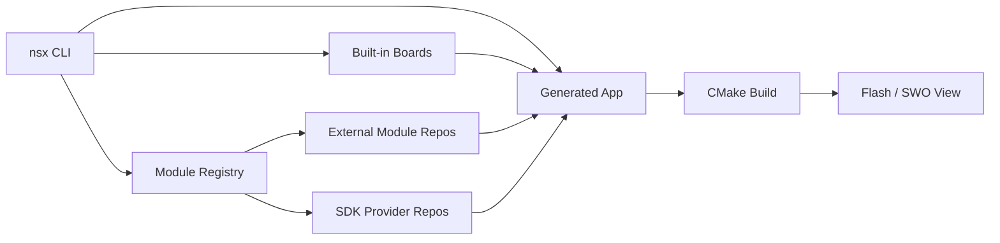

# NSX

NSX is a task-focused bare-metal application workflow for Ambiq SoCs and
boards.

It is designed for:

- board bring-up
- smoke-test applications
- profiling and instrumentation workflows
- targeted feature validation such as USB or interface demos

The main idea is simple:

1. create an app with `nsx create-app`
2. vendor the required board and module content into that app
3. use `nsx configure`, `nsx build`, `nsx flash`, and `nsx view`

Generated apps stay explicit and inspectable:

- one board
- one SoC
- one toolchain
- ordinary CMake structure

## Core Workflow

## What NSX Provides

- packaged templates for new apps
- packaged CMake helpers for build, flash, and SWO workflows
- built-in board definitions
- module and SDK provider resolution through metadata
- a CLI designed around the app lifecycle

## Where to Start

- New to NSX: go to **Getting Started**
- Already using it: go to **User Guide**
- Need exact flags or syntax: go to **Command Reference**
- Working on the platform itself: go to **Contributing**
