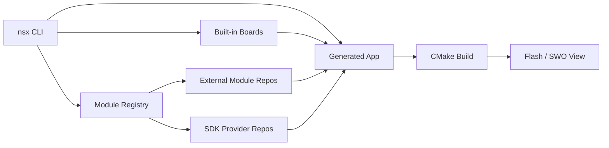

---
hide:
  - navigation
  - toc
---

<div class="hero-logo" markdown>
[](https://github.com/AmbiqAI/neuralspotx)
[](https://github.com/AmbiqAI/neuralspotx)
</div>

# NSX

**Task-focused bare-metal application workflow for Ambiq SoCs and boards.**

NSX is designed for board bring-up, smoke-test applications,
profiling and instrumentation workflows, and targeted feature validation
such as USB or interface demos.

## How it Works

```
nsx create-app   →   nsx configure   →   nsx build   →   nsx flash   →   nsx view
```

Generated apps stay explicit and inspectable — one board, one SoC, one
toolchain, ordinary CMake structure.



## Features

<div class="feature-grid" markdown>
<div class="card" markdown>
### :material-console: CLI Workflow
`create-app` · `configure` · `build` · `flash` · `view` — the full app lifecycle from a single tool.
</div>
<div class="card" markdown>
### :material-package-variant: Module Registry
Declarative module resolution — pull board support, HALs, peripherals, and libraries from versioned repos.
</div>
<div class="card" markdown>
### :material-chip: Board Definitions
Built-in definitions for Apollo4, Apollo510, and more. One board per app, zero ambiguity.
</div>
<div class="card" markdown>
### :material-cog: CMake Native
Standard CMake under the hood. Inspect, extend, or eject at any time.
</div>
</div>

## Where to Start

| You want to… | Go to |
|---|---|
| Get up and running | [Getting Started](getting-started/index.md) |
| Understand the app model | [User Guide](user-guide/app-model.md) |
| Look up exact CLI flags | [Command Reference](reference/cli-overview.md) |
| Try an example | [Examples](examples/hello_world.md) |
| Contribute to the platform | [Contributing](contributing/index.md) |
