---
hide:
  - navigation
  - toc
---

# NSX

**Task-focused bare-metal application workflow for Ambiq SoCs and boards.**

NSX is designed for board bring-up, smoke-test applications,
profiling and instrumentation workflows, and targeted feature validation
such as USB or interface demos.

## How it Works

``` mermaid
flowchart LR
    A("<strong>create&#8209;app</strong><br/>scaffold") --> B("<strong>configure</strong><br/>resolve modules") --> C("<strong>build</strong><br/>CMake + GCC") --> D("<strong>flash</strong><br/>J-Link / SWD") --> E("<strong>view</strong><br/>SWO output")
    style A fill:#4051b5,color:#fff,stroke:none,rx:8
    style B fill:#4051b5,color:#fff,stroke:none,rx:8
    style C fill:#4051b5,color:#fff,stroke:none,rx:8
    style D fill:#4051b5,color:#fff,stroke:none,rx:8
    style E fill:#4051b5,color:#fff,stroke:none,rx:8
```

Generated apps stay explicit and inspectable — one board, one SoC, one
toolchain, ordinary CMake structure.

## Features

### :material-console: CLI Workflow
`create-app` · `configure` · `build` · `flash` · `view` — the full app lifecycle from a single tool.

### :material-package-variant: Module Registry
Declarative module resolution — pull board support, HALs, peripherals, and libraries from versioned repos.

### :material-chip: Board Definitions
Built-in definitions for Apollo4, Apollo510, and more. One board per app, zero ambiguity.

### :material-cog: CMake Native
Standard CMake under the hood. Inspect, extend, or eject at any time.

## Where to Start

### :material-rocket-launch: New to NSX?
Start with **[Getting Started](getting-started/index.md)** — install prerequisites, create your first app, and build it.

### :material-book-open-variant: Already using it?
The **[User Guide](user-guide/app-model.md)** covers the app model, modules, boards, and build workflows in depth.

### :material-console-line: Need a CLI reference?
The **[Command Reference](reference/cli-overview.md)** has exact flags and syntax for every `nsx` subcommand.

### :material-flask-outline: Want working code?
Browse the **[Examples](examples/hello_world.md)** — hello world, CoreMark, PMU profiling, USB, and more.

