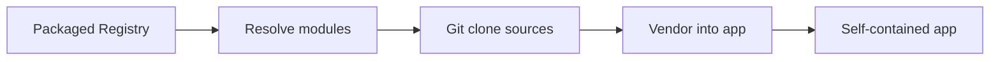

# App Model

NSX uses an app-first model. Each app is a self-contained project directory
with vendored modules, board definitions, and build helpers.

## Typical Layout

After `nsx create-app`, an app looks like this:

```text
<app-dir>/
  CMakeLists.txt
  nsx.yml
  src/
  cmake/nsx/
  modules/
  boards/
```

## Roles

- `nsx.yml` holds the app metadata and module state
- `modules/` holds vendored module content resolved from the packaged registry
- `boards/` holds vendored board definitions for the selected target
- `cmake/nsx/` holds copied NSX build helpers
- `src/` holds app-owned source code

## Why Apps Vendor Their Dependencies

The app is the primary unit of work from the user perspective. It gives the
user one place to:

- own app code and app metadata
- see exactly which board and modules are active
- build, flash, and debug with all build inputs present locally
- carry a vendored snapshot of the modules and board content the app actually uses



## Why Apps Have Their Own `modules/`

The app-level `modules/` directory is the vendored dependency snapshot.

When NSX adds or updates a module, it typically:

1. resolves the module through the registry
2. clones or fetches the module source from its upstream repo
3. copies the module content the app needs into `app/modules/`
4. records the enabled module state in `nsx.yml`

## Practical Rule

Use the app as the main place you create, inspect, build, flash, and debug.

## Important Rule

The generated app is the primary interface for day-to-day development.

NSX resolves module sources from the packaged registry and clones them as
needed, then vendors the board and module content into the app for configure,
build, flash, and view.
