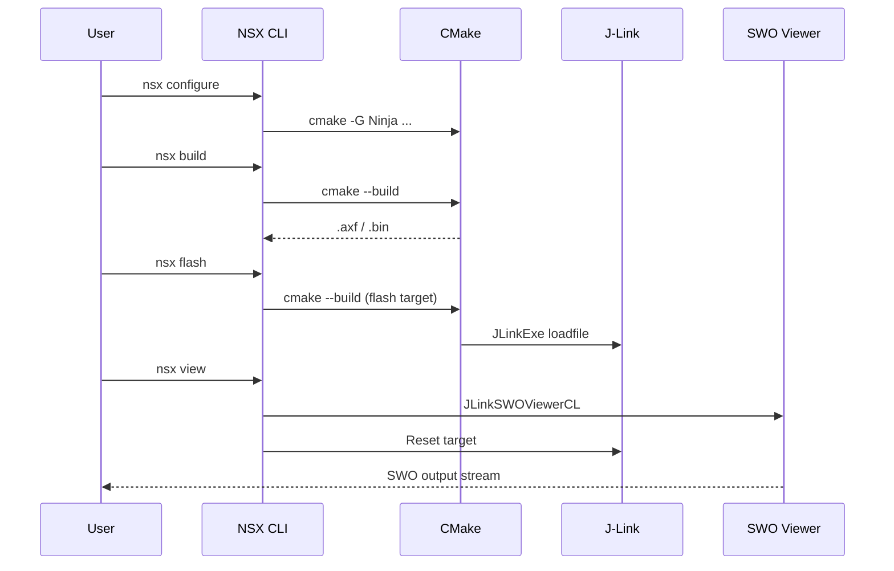

# Build, Flash, and View

NSX wraps the normal firmware lifecycle around generated CMake targets.

Run these commands from the app root when possible. NSX resolves the active app
by walking upward to the nearest `nsx.yml`, so `--app-dir` is only needed when
you want to target a different app explicitly.



## Configure

```bash
nsx configure
```

## Build

```bash
nsx build
```

## Flash

```bash
nsx flash
```

This builds the app if needed and then invokes the SEGGER flash path defined by
the app’s generated CMake support.

## View SWO Output

```bash
nsx view
```

`nsx view` launches the SEGGER SWO viewer for the active board target, waits briefly
for the viewer to attach, and then issues the app's normal SEGGER reset target.
This keeps the default reset behavior while avoiding the common case where SWO is
empty because the target was already running before the viewer attached.

If needed, you can disable the automatic reset with `--no-reset-on-open` or adjust
the attach delay with `--reset-delay-ms`.

## Clean

```bash
nsx clean
```

## Typical Sequence

```bash
nsx configure
nsx build
nsx flash
nsx view
```

For Apollo510, the validated behavior is to keep the normal `Reset` sequence and
open the viewer before resetting. A stronger SEGGER reset mode was not required.

If you are running from a source checkout, activate the `uv` environment first
and then use the same `nsx ...` commands.
