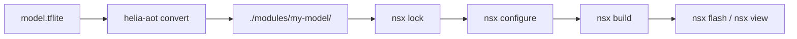

# Custom Models with helia-aot

NSX can host a model that you compile yourself with
[`helia-aot`](https://github.com/AmbiqAI/helia-aot), then vendor the generated output into an app as an
app-local module, and then build, flash, and run like any other NSX app.

This page documents the full manual workflow. Unlike the ready-made apps in
[Examples](../examples/index.md), this is a bring-your-own-model tutorial.

## When To Use This Flow

Use this workflow when:

- you have a `.tflite` model and want to compile it yourself
- you want the generated model code committed inside your app
- you want to understand how `helia-aot` output connects to normal NSX build
  flows

For general module authoring and registration, see
[Custom Modules](custom-modules.md).

## End-to-End Flow

At a high level:

1. create a normal NSX app
2. add any runtime dependencies the generated model needs
3. run `helia-aot convert` on your `.tflite`
4. place the generated output in `modules/<your-model>/`
5. mark that module as `source: { vendored: true }`
6. run the normal `nsx lock`, `nsx configure`, `nsx build`, `nsx flash`, and
   `nsx view` flow



## 1. Create A Fresh App

Start with a standard NSX app:

```bash
nsx create-app my_model_app --board apollo510_evb
cd my_model_app
```

This gives you a self-contained app with its own `nsx.yml`, vendored modules,
and board content.

## 2. Add Runtime Dependencies

If your generated model depends on NSX-managed runtime modules, add them before
you build. For the ResNet tutorial flow we used:

```bash
nsx module add nsx-helia-rt --app-dir .
```

That also pulls in `nsx-cmsis-nn` as needed.

## 3. Copy Your Model Into The App

Place the model artifact in the app root so the workflow is obvious and
repeatable:

```bash
cp /path/to/model.tflite ./model.tflite
```

## 4. Run helia-aot

Generate an NSX module directly into your app's `modules/` directory:

```bash
uvx --python python3.12 helia-aot convert \
    --model.path ./model.tflite \
    --module.path ./modules \
    --module.type nsx \
    --module.name my-model-aot \
    --module.prefix my_model \
    --platform.name apollo510_evb
```

Important flags:

- `--module.type nsx`: emits an NSX-ready module
- `--module.path ./modules`: places the generated module under your app's
  `modules/` directory
- `--module.name`: controls the module name recorded in `nsx-module.yaml`
- `--module.prefix`: controls the generated C symbol prefix

## 5. Check The Generated Module Layout

After conversion, the final layout should be:

```text
modules/my-model-aot/
├── CMakeLists.txt
├── nsx-module.yaml
├── includes-api/
└── src/
```

## 6. Mark The Module As Vendored

Add the generated module to `nsx.yml` and mark it as app-owned:

```yaml
modules:
  - name: my-model-aot
    source:
      vendored: true
```

`vendored` tells NSX that:

- the module lives inside this app
- `nsx sync` should not overwrite it
- the app should build exactly from the checked-in files under `modules/`

For background on vendored modules, see [Lock and Sync](lock-and-sync.md).

## 7. Make The App Link The Generated Module

Ensure the app's CMake target links the generated module target:

```cmake
target_link_libraries(my_model_app PRIVATE
    nsx::board_apollo510_evb
    nsx::runtime_core
    nsx::my_model_aot
)
```

Then update your application code to include the generated headers and call the
generated entry points, typically:

```c
#include "my_model_model.h"

my_model_model_context_t model_ctx = {0};
status = my_model_model_init(&model_ctx);
status = my_model_model_run(&model_ctx);
```

The generated module's `README.md` and headers under `includes-api/` are the
best source of truth for the exact symbol names and tensor accessors.

## 8. Refresh Lock Metadata

Once the vendored module is in place:

```bash
nsx lock --app-dir .
```

This records the content hash of the vendored module in `nsx.lock`.

## 9. Build, Flash, And Run

From the app root:

```bash
nsx configure --app-dir .
nsx build --app-dir .
nsx flash --app-dir .
nsx view --app-dir .
```

That is the same build flow as any other NSX app. The main difference is that
your model module was generated locally instead of coming from the packaged
registry.

## What To Commit

For a reproducible app, commit:

- `nsx.yml`
- `nsx.lock`
- `model.tflite` if your workflow wants the original artifact in-repo
- `modules/my-model-aot/`
- your app sources and `CMakeLists.txt`

## Practical Notes

- `helia-aot` emits generated code plus an `nsx-module.yaml`, which is why this
  fits cleanly into NSX's app-local module model.
- Generated module names and C symbols come from `--module.name` and
  `--module.prefix`; choose those carefully before sharing the app.

## Related Reading

- [Examples](../examples/index.md) for ready-to-build reference apps
- [kws_infer Example](../examples/kws_infer.md) for a maintained inference app
- [Custom Modules](custom-modules.md) for module metadata and registration
- [Lock and Sync](lock-and-sync.md) for vendored module behavior
