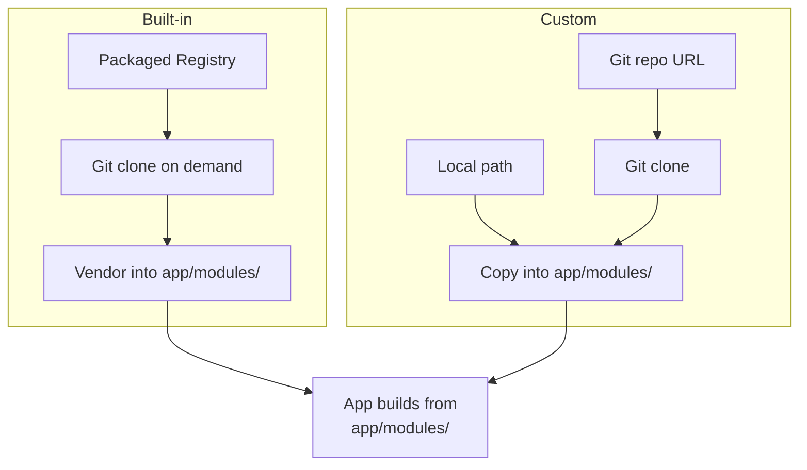

# Custom Modules

NSX supports custom modules alongside the built-in catalog. A custom module
is any module not present in the packaged NSX registry. Custom modules are
registered per-app and follow the same metadata, build, and compatibility
contracts as built-in modules.

## Module Types

| Source       | Built-in              | Custom                                |
| ------------ | --------------------- | ------------------------------------- |
| **Git**      | Packaged registry     | `nsx module register --project-url`   |
| **Local**    | —                     | `nsx module register --project-local-path` |



Both built-in and custom modules are vendored into the app's `modules/`
directory when enabled. The only difference is how NSX discovers them:

- **Built-in** modules are resolved from the packaged `registry.lock.yaml`.
- **Custom** modules are resolved from the app-local `nsx.yml` overrides
  created by `nsx module register`.

## Requirements

A custom module must provide two files at minimum:

### 1. `nsx-module.yaml`

The module metadata file defines identity, build targets, dependencies, and
compatibility. The schema follows the same format used by built-in modules.

```yaml
schema_version: 1

module:
  name: my-custom-module
  type: runtime           # runtime | backend_specific | board | tooling
  version: "0.1.0"

support:
  ambiqsuite: true
  zephyr: false

summary: Short description of what the module provides.

capabilities:
  - my_capability

use_cases:
  - describe when someone would need this module

agent_keywords:
  - terms
  - for
  - search

build:
  cmake:
    package: my_custom_module          # CMake find_package name
    targets:
      - nsx::my_custom_module          # namespaced CMake target

depends:
  required:
    - nsx-core                         # modules this depends on
  optional: []

compatibility:
  boards:
    - "*"                              # or list specific boards
  socs:
    - apollo510
  toolchains:
    - arm-none-eabi-gcc
```

**Required fields:** `schema_version`, `module.name`, `module.type`,
`module.version`, `build.cmake.package`, `build.cmake.targets`,
`depends.required`, `depends.optional`, `compatibility.boards`,
`compatibility.socs`, `compatibility.toolchains`.

**Optional fields:** `summary`, `capabilities`, `use_cases`,
`agent_keywords`, `provides`, `support`.

### 2. `CMakeLists.txt`

The module root must contain a `CMakeLists.txt` that defines the library
target declared in `nsx-module.yaml`.

```cmake
add_library(my_custom_module STATIC
    ${CMAKE_CURRENT_LIST_DIR}/src/my_source.c
)
set_target_properties(my_custom_module PROPERTIES EXPORT_NAME my_custom_module)
add_library(nsx::my_custom_module ALIAS my_custom_module)

target_link_libraries(my_custom_module PUBLIC
    ${NSX_BOARD_FLAGS_TARGET}
    nsx_core
)

target_include_directories(my_custom_module PUBLIC
    $<BUILD_INTERFACE:${CMAKE_CURRENT_LIST_DIR}/includes-api>
)
```

**Key conventions:**

- The library name must match `build.cmake.package` from the metadata.
- Create a namespaced alias matching `build.cmake.targets`.
- Link against `${NSX_BOARD_FLAGS_TARGET}` for board-level compiler flags.
- Use `includes-api/` for the public header directory.
- Reference dependencies by their CMake target name (e.g. `nsx_core`).

## Recommended Directory Layout

```
my-custom-module/
├── CMakeLists.txt
├── nsx-module.yaml
├── includes-api/
│   └── my_header.h
└── src/
    └── my_source.c
```

## Validating a Custom Module

Before registering, validate that your `nsx-module.yaml` has all required
fields:

```bash
nsx module validate path/to/my-custom-module/nsx-module.yaml
```

For machine-readable output:

```bash
nsx module validate path/to/my-custom-module/nsx-module.yaml --json
```

The validator checks `schema_version`, module identity, build targets,
dependencies, compatibility lists, and supported module types.

The same validation is available in Python:

```python
from neuralspotx import validate_module_metadata

data = validate_module_metadata("path/to/nsx-module.yaml")
```

## Registering a Custom Module

### From a Local Path

Use `--project-local-path` when the module source lives on disk.

```bash
nsx module register my-custom-module \
  --metadata /path/to/my-custom-module/nsx-module.yaml \
  --project my_custom_repo \
  --project-local-path /path/to/my-custom-module \
  --app-dir .
```

NSX copies the module content into the app's `modules/my-custom-module/`
directory, exactly like a built-in module.

### From a Git Repository

Use `--project-url` and `--project-revision` for a git-backed module.

```bash
nsx module register my-custom-module \
  --metadata modules/my-custom-module/nsx-module.yaml \
  --project my_custom_repo \
  --project-url https://github.com/myorg/my-custom-module.git \
  --project-revision main \
  --project-path modules/my-custom-module \
  --app-dir .
```

NSX clones the repository, resolves the module from the specified path within
the repo, and vendors it into the app.

### Overriding a Built-in Module

You can override a built-in module with a custom version by using `--override`:

```bash
nsx module register nsx-core \
  --metadata /path/to/my-fork/nsx-module.yaml \
  --project my_nsx_core_fork \
  --project-local-path /path/to/my-fork \
  --override \
  --app-dir .
```

The override is app-local and does not affect other apps or the packaged
registry.

## Using the Python API

The same registration workflows are available programmatically:

```python
from neuralspotx import register_module, ModuleRegisterRequest

# Local module
register_module(ModuleRegisterRequest(
    app_dir="my-app",
    module="my-custom-module",
    metadata="/path/to/my-custom-module/nsx-module.yaml",
    project="my_custom_repo",
    project_local_path="/path/to/my-custom-module",
))

# Git module
register_module(ModuleRegisterRequest(
    app_dir="my-app",
    module="my-custom-module",
    metadata="modules/my-custom-module/nsx-module.yaml",
    project="my_custom_repo",
    project_url="https://github.com/myorg/my-custom-module.git",
    project_revision="main",
    project_path="modules/my-custom-module",
))
```

## Compatibility Rules

Custom modules follow the same compatibility constraints as built-in modules:

- The module's `compatibility.socs` must include the app's target SoC (or `"*"`).
- The module's `compatibility.boards` must include the app's target board (or `"*"`).
- The module's `compatibility.toolchains` must include the app's toolchain.
- All `depends.required` modules must be available and compatible.
- Dependency cycles are rejected.

## Discovery

Custom modules registered for an app appear in all discovery commands:

```bash
nsx module list --app-dir .
nsx module describe my-custom-module --app-dir .
nsx module search "my capability" --app-dir .
```

They also appear in the Python API:

```python
from neuralspotx import list_modules, describe_module, search_modules
from pathlib import Path

modules = list_modules(app_dir=Path("my-app"))
record = describe_module("my-custom-module", app_dir=Path("my-app"))
results = search_modules("my capability", app_dir=Path("my-app"))
```
