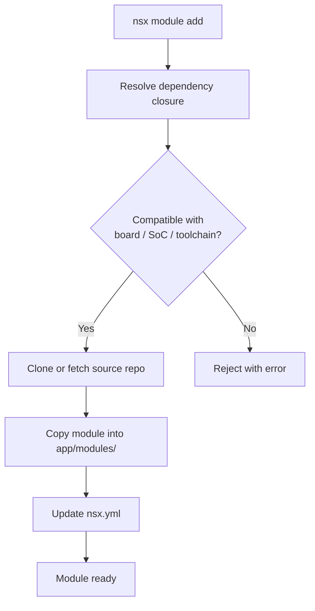

# Modules

NSX manages modules as app-local vendored dependencies.

Built-in modules come from the packaged NSX registry. Their default source is
the upstream repo and revision recorded there. Custom modules are registered
explicitly per app.

## Module Terms

- first-class module: a module present in the packaged NSX registry and supported through the normal CLI and API workflows
- vendored module: module content copied into `app/modules/` for the specific app
- built-in module: a registry-backed module whose default source comes from the packaged catalog
- custom module: a module registered explicitly for one app, either from a local filesystem path or a git-backed project entry

First-class and vendored are not opposites.
A first-class module is about catalog and support status.
Vendored is about where the app builds from.

In normal use, a first-class module is resolved from the packaged registry and
then vendored into the app.

For a high-level overview of the current first-class module catalog, see
[First-Class Modules](first-class-modules.md).

## List Modules

```bash
nsx module list --app-dir <app-dir>
```

This shows the built-in module catalog and highlights which ones are enabled
for the app.

If you want the packaged catalog without app state, use:

```bash
nsx module list --registry-only
```

## Add a Module

```bash
nsx module add nsx-peripherals --app-dir <app-dir>
```

When you add a module, NSX:

1. resolves dependency closure
2. validates compatibility for board, SoC, and toolchain
3. clones or fetches the module source repo as needed
4. copies the selected module into `app/modules/`
5. updates `nsx.yml` and generated module lists



This is the normal path for installing a supported built-in module into an app.

## Remove a Module

```bash
nsx module remove nsx-peripherals --app-dir <app-dir>
```

## Update Modules

```bash
nsx module update --app-dir <app-dir>
```

Use this after changing registry defaults or when you want to re-vendor module
content from the configured source revision.

## Register a Custom Module

Use `nsx module register` for local-only modules or custom git repos that are
not part of the built-in NSX catalog.

Register from a local filesystem path:

```bash
nsx module register my-custom-module \
  --metadata /path/to/my-custom-module/nsx-module.yaml \
  --project my_custom_repo \
  --project-local-path /path/to/my-custom-module \
  --app-dir <app-dir>
```

Register from a git-backed project definition:

```bash
nsx module register my-custom-module \
  --metadata /path/to/my-custom-module/nsx-module.yaml \
  --project my_custom_repo \
  --project-url https://github.com/myorg/my_custom_repo.git \
  --project-revision main \
  --project-path modules/my_custom_repo \
  --app-dir <app-dir>
```

In both cases, the registration is app-local. NSX records the custom project
and module override in `nsx.yml`, resolves it as part of the app's effective
registry, and vendors the module into that app.

For normal app development, you do not need a separate module-repo checkout.
NSX resolves built-in modules from the packaged registry and clones them as
needed, then vendors the selected module content into the app.

## Module Resolution

NSX resolves built-in modules from the packaged registry. Module sources are
git-cloned from their upstream repos on demand.

That means:

- enabled module state is an app concern
- vendored module content is an app concern
- app-local custom module registration is an app concern

## Common Constraints

- a module must be compatible with the app target
- dependency cycles are rejected
- SDK provider selection must remain coherent for the target
