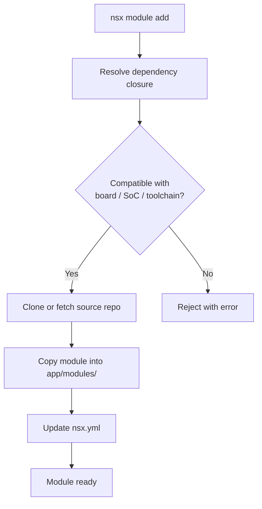

# Modules

A module is a reusable unit of firmware — an SDK provider, a HAL or BSP
wrapper, a peripheral driver, a profiler, and so on. Each app declares the
modules it needs in `nsx.yml`, and NSX assembles them into the app's build.

Whatever a module's origin, NSX always **vendors** it: the module's source is
copied into the app's `modules/` directory so the app builds from a
self-contained tree with no hidden external references.

## Where a Module Comes From

Modules are not really different *types* — they differ only in **where their
source comes from**. That choice is the one thing you decide when adding a
module. There are three options, from most common to least:

| Source | When to use | Committed in app git? | How to add |
| --- | --- | --- | --- |
| **Registry module** | The normal case: a supported module from the packaged NSX catalog. | No — gitignored and re-vendored from upstream | `nsx module add <name>` |
| **Custom module** | A third-party or in-house module from a local path or git repo that is not in the catalog. | No — gitignored and re-vendored from its source | `nsx module register …`, then `nsx module add <name>` |
| **Vendored-in-app module** | Code that must live with the app, such as AOT-generated kernels or a one-off in-house driver. | Yes — committed and never touched by `nsx sync` | `nsx module add <name> --vendored` |

!!! note "What 'first-class' means"
    Elsewhere you may see registry modules called **first-class**. That is not
    a separate kind of module — it simply means the module is in the packaged
    catalog and supported through the normal CLI and API workflows.

!!! tip "Advanced: local mirror"
    A fourth option, `nsx module add <name> --local`, mirrors a module from an
    external path on every `nsx sync` (gitignored, not committed). Use it when
    actively developing a module outside the app. See
    [Custom Modules](custom-modules.md).

For the built-in registry catalog, compatibility tables, and supported module
families, see [Module Catalog](module-catalog.md).

For local or third-party module authoring, registration, and scaffolding, see
[Custom Modules](custom-modules.md).

In the examples below, run the commands from the app root unless noted
otherwise. Commands that inspect app-local module state use `--app-dir .`
explicitly.

## List Modules

```bash
nsx module list --app-dir .
```

This shows the built-in module catalog and highlights which ones are enabled
for the app.

If you want the packaged catalog without app state, use:

```bash
nsx module list --registry-only
```

## Add a Module

```bash
nsx module add nsx-uart
```

When you add a module, NSX:

1. resolves dependency closure
2. validates compatibility for board, SoC, and toolchain
3. clones or fetches the module source repo as needed
4. copies the selected module into `app/modules/`
5. updates `nsx.yml` and generated module lists



This is the normal path for installing a supported built-in module into an app.

## Remove a Module

```bash
nsx module remove nsx-uart
```

## Update Modules

```bash
nsx module update
```

Use this after changing registry defaults or when you want to re-vendor module
content from the configured source revision.

## Register a Custom Module

Use `nsx module register` for local-only modules or custom git repos that are
not part of the built-in NSX catalog.

Register from a local filesystem path:

```bash
cd <app-dir>
nsx module register my-custom-module \
  --metadata /path/to/my-custom-module/nsx-module.yaml \
  --project my_custom_repo \
  --project-local-path /path/to/my-custom-module
```

Register from a git-backed project definition:

```bash
cd <app-dir>
nsx module register my-custom-module \
  --metadata /path/to/my-custom-module/nsx-module.yaml \
  --project my_custom_repo \
  --project-url https://github.com/myorg/my_custom_repo.git \
  --project-revision main \
  --project-path modules/my_custom_repo
```

In both cases, the registration is app-local. NSX records the custom project
and module override in `nsx.yml`, resolves it as part of the app's effective
registry, and vendors the module into that app.

For normal app development, you do not need a separate module-repo checkout.
NSX resolves built-in modules from the packaged registry and clones them as
needed, then vendors the selected module content into the app.

## Module Resolution

NSX resolves built-in modules from the packaged registry. Module sources are
git-cloned from their upstream repos on demand.

That means:

- enabled module state is an app concern
- vendored module content is an app concern
- app-local custom module registration is an app concern

## Common Constraints

- a module must be compatible with the app target
- dependency cycles are rejected
- SDK provider selection must remain coherent for the target
