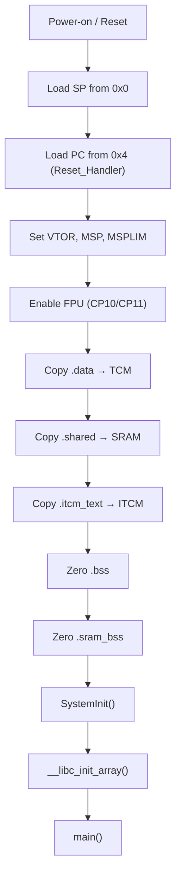

# Startup and Linker Scripts

This page explains what happens between power-on and `main()`, how linker
scripts organize memory, and common pitfalls when working with bare-metal
Ambiq targets.

## What Happens Before `main()`

When the Cortex-M core comes out of reset, the hardware loads the initial
stack pointer from address 0x0 and the reset vector from address 0x4, then
jumps to `Reset_Handler` in `startup_gcc.c`.



### Step-by-step

| Step | What it does | Why it matters |
|------|-------------|---------------|
| **VTOR** | Sets the vector table base address | Interrupt handlers won't work without this |
| **MSP / MSPLIM** | Sets main stack pointer and limit | Stack overflow detection (M55 only) |
| **FPU** | Enables coprocessors CP10 and CP11 | Any float operation will hardfault without this |
| **Copy .data** | Copies initialized globals from MRAM to TCM | Variables declared with initial values need their data in RAM |
| **Copy .shared** | Copies `NSX_MEM_SRAM` data from MRAM to shared SRAM | Large initialized buffers like model weights |
| **Copy .itcm_text** | Copies `NSX_MEM_FAST_CODE` from MRAM to ITCM | Hot code paths that run from tightly-coupled memory |
| **Zero .bss** | Zeroes uninitialized globals in TCM | C standard requires these to be zero |
| **Zero .sram_bss** | Zeroes `NSX_MEM_SRAM_BSS` in shared SRAM | Tensor arenas, DMA buffers |
| **SystemInit()** | CMSIS system init — basic clock setup | Called by the C runtime before constructors |
| **__libc_init_array()** | Calls C++ global constructors | Static objects need construction before `main()` |
| **main()** | Your application entry point | Everything above runs with default (unconfigured) hardware |

!!! warning "C++ constructors run before `main()`"
    Global constructors execute with hardware in reset-default state — no
    caches, no SIMOBUCK, no clock config. Keep constructors lightweight.
    Defer hardware-dependent initialization to `main()`.

## Copy Loop Pattern

The startup code uses a "check-before-copy" pattern that handles empty
sections correctly:

```c
pSrc = &_init_data;   // load address (in MRAM)
pDst = &_sdata;       // destination (in TCM)
goto check;
loop:
    *pDst++ = *pSrc++;
check:
    if (pDst < &_edata) goto loop;
```

This avoids copying when source == destination (which happens when both
symbols resolve to the same address).

## Linker Script Anatomy

NSX targets use GCC linker scripts (`.ld` files) in
`nsx-core/src/<soc>/gcc/`. There are three variants per SoC:

| Script | Boot loader | Use case |
|--------|-----------|----------|
| `linker_script_sbl.ld` | Secure Boot Loader | Default for most apps |
| `linker_script_nbl.ld` | No Boot Loader | Direct flash, no SBL |
| `linker_script_itcm_sbl.ld` | SBL + ITCM code | TFLM kernels in ITCM |

### Memory Regions (Apollo510)

```
MEMORY
{
    MCU_ITCM     (rwx) : ORIGIN = 0x00000000, LENGTH = 256K
    MCU_MRAM     (rx)  : ORIGIN = 0x00410000, LENGTH = ~4 MB
    MCU_TCM      (rwx) : ORIGIN = 0x20000000, LENGTH = 496K
    SHARED_SRAM  (rwx) : ORIGIN = 0x20080000, LENGTH = 3 MB
}
```

### Section Layout in TCM

TCM holds the runtime data — stack, heap, initialized data, and BSS.
The layout order matters:

```
MCU_TCM (496 KB)
┌──────────────────┐ 0x20000000
│  .stack (NOLOAD) │  ← grows downward from top of stack
├──────────────────┤
│  .heap  (NOLOAD) │  ← _sbrk grows upward
├──────────────────┤
│  .data           │  ← initialized globals (copied from MRAM)
├──────────────────┤
│  .bss            │  ← zeroed globals
├──────────────────┤
│  (free)          │
└──────────────────┘ 0x2007C000
```

An `ASSERT` guard catch overflows at link time:

```
ASSERT( _ebss <= ORIGIN(MCU_TCM) + LENGTH(MCU_TCM),
        "TCM overflow: stack+heap+data+bss exceed 496K" )
```

### Section Layout in Shared SRAM

```
SHARED_SRAM (3 MB)
┌──────────────────┐ 0x20080000
│  .sram_bss       │  ← NSX_MEM_SRAM_BSS (zeroed at boot)
├──────────────────┤
│  .shared         │  ← NSX_MEM_SRAM (copied from MRAM)
├──────────────────┤
│  (free)          │
└──────────────────┘ 0x20380000
```

### Required Sections

Every linker script must include these sections for correct operation:

| Section | Required for | Missing symptom |
|---------|-------------|-----------------|
| `.preinit_array` | C++ constructors | Static objects not constructed |
| `.init_array` | C++ constructors | Static objects not constructed |
| `.fini_array` | C++ destructors | (Usually not critical) |
| `.sram_bss` | `NSX_MEM_SRAM_BSS` | Linker error or data goes to TCM |
| `.shared` with `*(.shared*)` | `NSX_MEM_SRAM` | Data placed incorrectly |

## Stack and Heap

### Apollo510 (Separate Sections)

Stack and heap are separate NOLOAD sections in TCM:

```c
// In startup_gcc.c
#ifndef STACK_SIZE
#define STACK_SIZE  8192   // uint32_t words = 32 KB
#endif
#ifndef HEAP_SIZE
#define HEAP_SIZE   1024   // uint32_t words = 4 KB
#endif

static uint32_t g_pui32Stack[STACK_SIZE] __attribute__((section(".stack")));
static uint32_t g_pui32Heap[HEAP_SIZE]   __attribute__((section(".heap")));
```

!!! note "HEAP_SIZE is in uint32_t words"
    `HEAP_SIZE=1024` means 1024 × 4 = 4096 bytes (4 KB), not 1024 bytes.

### Apollo3P (Shared Region)

On Apollo3P, stack and heap **share** a single memory region:

```c
static uint32_t g_pui32Stack[STACK_SIZE - HEAP_SIZE];
```

Increasing `HEAP_SIZE` directly reduces stack space. This was a common
source of crashes in legacy neuralSPOT — a large heap would shrink the
stack enough to cause corruption.

### Overflow Protection

The linker scripts include an `ASSERT` that catches TCM overflow at
link time:

```
ASSERT( _ebss <= ORIGIN(MCU_TCM) + LENGTH(MCU_TCM),
        "TCM overflow: stack+heap+data+bss exceed 507904 bytes" )
```

If you hit this, options include:

1. Reduce `HEAP_SIZE` or `STACK_SIZE`
2. Move large buffers to shared SRAM with `NSX_MEM_SRAM` or `NSX_MEM_SRAM_BSS`
3. Move model weights to shared SRAM or keep them in MRAM

## Linker Script Variants

### Standard (`linker_script_sbl.ld`)

Default for SBL-based boot. Code in MRAM, data in TCM, ITCM for
`NSX_MEM_FAST_CODE`.

### No Boot Loader (`linker_script_nbl.ld`)

MRAM starts at `0x00400000` (no SBL offset). Otherwise identical.

### ITCM-Heavy (`linker_script_itcm_sbl.ld`)

Pulls TFLM kernel object files into ITCM using `KEEP` directives:

```
KEEP(conv*.o      (.text .text.* .rodata .rodata.*))
KEEP(softmax*.o   (.text .text.* .rodata .rodata.*))
KEEP(micro*.o     (.text .text.* .rodata .rodata.*))
```

This can significantly accelerate inference by running inner loops from
0-wait-state ITCM instead of flash. Use when ITCM capacity (256 KB) is
sufficient for the model's hot kernels.

## Common Pitfalls

!!! danger "Large model weights can overflow TCM"
    A 300 KB model in `.data` (TCM) plus 64 KB arena in `.bss` plus
    32 KB stack plus 4 KB heap = 400 KB — leaving only 96 KB for all
    other globals. Use `NSX_MEM_SRAM` for large models.

!!! warning "C++ init_array sections missing"
    If the linker script is missing `.preinit_array`, `.init_array`, or
    `.fini_array`, C++ static constructors silently won't run. TFLM's
    MicroMutableOpResolver relies on constructors — missing them causes
    mysterious inference failures.

!!! warning "Shared SRAM must be powered"
    Data placed with `NSX_MEM_SRAM` or `NSX_MEM_SRAM_BSS` lives in
    shared SRAM. If a power management routine powers down shared SRAM,
    that data is lost. Ensure your power config keeps SRAM powered when
    using these macros.

!!! info "SBL vs NBL MRAM origin"
    SBL scripts use `ORIGIN = 0x00410000` (64 KB offset for the boot
    loader). NBL scripts use `ORIGIN = 0x00400000`. Using the wrong
    script for your boot configuration will cause the app to jump to
    the wrong address.
