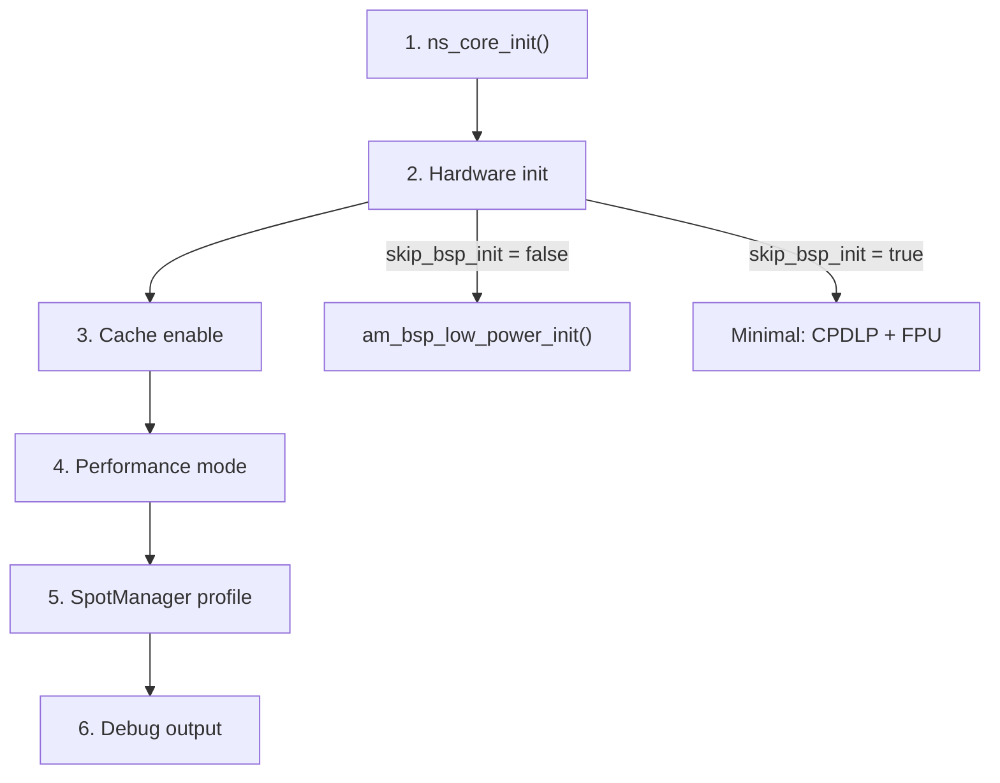

# System Initialization

NSX provides a modular system initialization API in `nsx_system.h` that
replaces ad-hoc startup boilerplate with composable, order-aware building
blocks.

## Quick Start

```c
#include "nsx_system.h"

int main(void) {
    // One call sets up: core runtime, caches, HP mode, ITM debug, SpotManager
    nsx_system_config_t cfg = nsx_system_development;
    nsx_system_init(&cfg);

    ns_printf("Hello from NSX\n");
}
```

## Presets

Three built-in presets cover the most common scenarios:

| Preset | Perf | Cache | Debug | SpotMgr | BSP Init |
|--------|------|-------|-------|---------|----------|
| `nsx_system_development` | HIGH | yes | ITM/SWO | yes | full |
| `nsx_system_inference` | HIGH | yes | none | yes | full |
| `nsx_system_minimal` | LOW | no | none | no | skip |

Start from a preset and override individual fields:

```c
nsx_system_config_t cfg = nsx_system_development;
cfg.skip_bsp_init = true;   // skip the 2-second BSP stabilization delay
cfg.debug.transport = NSX_DEBUG_UART;  // use UART instead of SWO
nsx_system_init(&cfg);
```

## What `nsx_system_init()` Does

The init function performs six steps in a fixed, safe order:



Ordering matters — each step depends on the previous:

1. **Core runtime** — gates all other NSX API calls
2. **Hardware init** — enables cache power domain (CPDLP), SpotManager, FPU
3. **Cache** — requires CPDLP from step 2 (silently fails without it on Apollo5)
4. **Performance mode** — HP clock (burst mode on Apollo3, MCU mode select on Apollo4+)
5. **SpotManager profile** — requires SpotManager init from step 2
6. **Debug output** — must come after BSP init (which disables debug for low power)

## Performance Modes

The `nsx_perf_mode_e` enum maps to SoC-specific clock configurations:

| Mode | Apollo3/3P | Apollo4/4P | Apollo510 | Apollo330P/510L |
|------|-----------|-----------|-----------|-----------------|
| `NSX_PERF_LOW` | 48 MHz | 96 MHz LP | 96 MHz LP | LP |
| `NSX_PERF_MEDIUM` | 96 MHz burst | 192 MHz HP | 192 MHz HP | HP1 |
| `NSX_PERF_HIGH` | 96 MHz burst | 192 MHz HP | 192 MHz HP | HP2 |

## Debug Output

Two transports are supported:

| Transport | How it works |
|-----------|-------------|
| `NSX_DEBUG_ITM` | SWO/ITM over JLink. On Apollo510 this handles DCU enable, TPIU config, SWO pin, and printf backend automatically. On Apollo3/4 uses the BSP helper. |
| `NSX_DEBUG_UART` | UART through BSP pins. Calls `am_bsp_uart_printf_enable()`. |
| `NSX_DEBUG_NONE` | No debug output (production). |

After init, use `ns_printf()` for output — it routes through whichever
backend was configured.

## Fine-Grained Control

For full control, skip `nsx_system_init()` and call individual building
blocks in order:

```c
#include "nsx_system.h"

int main(void) {
    // 1. Core runtime (required first)
    ns_core_config_t core_cfg = { .api = &ns_core_V1_0_0 };
    ns_core_init(&core_cfg);

    // 2. Hardware init
    nsx_minimal_hw_init();       // fast: CPDLP + FPU, no 2s delay
    // nsx_hw_init();            // full: am_bsp_low_power_init()

    // 3. Cache (requires CPDLP from step 2)
    nsx_cache_enable();          // from nsx_mem.h

    // 4. Performance mode
    nsx_set_perf_mode(NSX_PERF_HIGH);

    // 5. Debug output
    nsx_debug_config_t dbg = { .transport = NSX_DEBUG_ITM };
    nsx_debug_init(&dbg);

    // 6. Application code...
    ns_printf("Ready\n");
}
```

## `nsx_hw_init()` vs `nsx_minimal_hw_init()`

| | `nsx_hw_init()` | `nsx_minimal_hw_init()` |
|-|-----------------|------------------------|
| Calls | `am_bsp_low_power_init()` | Platform-specific subset |
| Startup delay | ~2 seconds (AP510) | None |
| SIMOBUCK | Configured | Not configured |
| Clock gates | Optimized | Not configured |
| Cache | Enabled (AP5) | Not enabled (AP5) |
| FPU | Yes | Yes |
| CPDLP | Yes (AP5) | Yes (AP5) |
| SpotManager | Initialized | Initialized (AP5) |
| Debug/trace | Disabled | Not touched |

Use `nsx_minimal_hw_init()` when you want fast startup during development
and don't need full power optimization. Use `nsx_hw_init()` for production
deployments where power efficiency matters.

## Platform Backends

`nsx_system` is split into platform-independent sequencing (`nsx_system.c`)
and per-SoC backends that implement five functions:

| Backend | SoCs | Key differences |
|---------|------|-----------------|
| `apollo3p/` | Apollo3, Apollo3P | Burst mode, unified cache, no DCU, GPIO 41 SWO |
| `apollo4p/` | Apollo4P, Apollo4L | LP/HP mode, unified cache, BSP handles DCU |
| `apollo510/` | Apollo510, 510B, 510L, 5A, 5B, 330P | Split I/D cache, CPDLP, SpotManager, manual DCU+ITM |

The correct backend is selected automatically by CMake via `NSX_SOC_FAMILY`.

## Common Pitfalls

!!! warning "Cache silently not enabled (Apollo5)"
    On Apollo5 family, `am_hal_cachectrl_icache_enable()` checks
    `PWRMODCTL->CPDLPSTATE` and returns failure **silently** if the cache
    power domain is not active. Without caches, inference runs 3–4x slower
    with no visible error. Always call `nsx_hw_init()` or
    `nsx_minimal_hw_init()` before `nsx_cache_enable()`.

!!! warning "BSP disables debug by default"
    `am_bsp_low_power_init()` calls `am_hal_debug_trace_disable()` for
    minimum power. If you need ITM/SWO output, configure debug **after**
    BSP init — which `nsx_system_init()` handles automatically.

!!! warning "SWO/ITM on Apollo510 requires manual setup"
    The BSP's `am_bsp_itm_printf_enable()` on Apollo510 fails silently
    because the DCU isn't enabled at early init. `nsx_debug_init()` with
    `NSX_DEBUG_ITM` handles the full DCU → TPIU → SWO → printf chain.

!!! info "SpotManager is Apollo5-family only"
    The `spot_mgr_profile` config field is a no-op on Apollo3 and Apollo4.
    It's safe to leave enabled in portable code.
